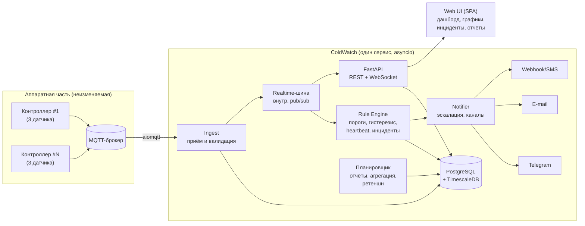

# ColdWatch — система контроля холодовой цепи для медицинских препаратов

**Концепция полной переработки проекта AlertTemp**

> Статус: проект концепции для согласования · Версия 1.0 · Июль 2026

---

## 1. Назначение и контекст

### 1.1. Что это

ColdWatch — сервис непрерывного мониторинга температуры в холодильном оборудовании,
где хранятся термочувствительные медицинские препараты (вакцины, иммунобиологические
препараты, инсулины и т.п.). Система:

- непрерывно собирает показания с датчиков температуры;
- визуализирует их в web-интерфейсе (графики, таблицы, статусы в реальном времени);
- отслеживает выход за установленные пороги и длительность нарушений;
- рассылает оповещения ответственному персоналу с эскалацией;
- **помогает принять решение: пригоден препарат к применению или условия хранения
  нарушены и требуется карантин/списание.**

Последний пункт — ключевое отличие от «просто мониторинга температуры». Продукт
системы — не график, а **достоверный, документированный ответ на вопрос
"можно ли применять препарат"**.

### 1.2. Предметная область и нормативный контекст

Для иммунобиологических препаратов типовой режим хранения — **+2…+8 °C**.
Требования к контролю холодовой цепи (СП 3.3.2.3332-16, рекомендации ВОЗ, GDP):

- непрерывная регистрация температуры с фиксированным интервалом;
- журналирование всех отклонений (экскурсий) с временем начала, окончания,
  пиковым значением и длительностью;
- хранение записей о температурном режиме в течение установленного срока
  (годы, а не месяцы — в отличие от исходного проекта с ротацией 180 дней);
- неизменяемость записей (audit trail): кто, когда и что менял в настройках
  порогов, пользователях, устройствах;
- дублирование каналов оповещения и реакция персонала с подтверждением
  (acknowledge).

Система не претендует на формальную валидацию по GxP, но проектируется так,
чтобы её данные можно было предъявить при проверке: полный журнал, отчёты,
отсутствие «дыр» в данных, зафиксированные решения персонала.

### 1.3. Пользователи

| Роль | Задачи |
|---|---|
| **Медицинский персонал** (operator) | Видит статусы холодильников, получает оповещения, подтверждает инциденты, фиксирует принятые меры, формирует отчёты по экскурсиям |
| **Администратор** (admin) | Управляет устройствами, порогами, пользователями, каналами оповещений, политиками эскалации |
| **Наблюдатель** (viewer) | Только просмотр (например, руководство, аудитор) |

---

## 2. Аппаратная часть (неизменяемое ограничение)

Единственное, что наследуется от исходного проекта, — протокол взаимодействия
с контроллерами:

- Контроллеры подключаются к сети по WiFi и конфигурируются отдельно —
  система не имеет на них никакого влияния и обратного канала.
- После подключения контроллер непрерывно публикует показания в
  **MQTT-брокер** (Mosquitto, `10.10.0.3:1883`).
- **Один контроллер = 3 датчика температуры** (физическая единица
  оборудования), но **сам контроллер никак себя не обозначает**: в эфире
  видны только идентификаторы отдельных датчиков (топики). Принадлежность
  трёх датчиков одному контроллеру знает только человек, который их
  устанавливал.
- Payload сообщения — **число (float) в виде текста**, температура в °C.
- Топик — это id датчика. Структура топиков заранее неизвестна и не
  контролируется нами.
- Контроллеры **не буферизуют** данные: если сообщение не принято — оно
  потеряно. Отсюда требование к постоянной доступности приёмника и к
  детекции «молчащих» датчиков.

Следствия для дизайна:

1. Приём данных должен быть максимально простым и отказоустойчивым —
   отдельный ingest-компонент, который умеет только «принять, провалидировать,
   записать».
2. Никаких подписок на `#` вслепую с автосозданием сущностей: новые топики
   попадают в **очередь обнаружения** и подключаются к системе явным решением
   администратора (см. §5.1).
3. Имя топика — внешние недоверенные данные: никогда не используется как имя
   таблицы/идентификатор SQL (уязвимость исходного проекта), только как
   значение в столбце.
4. Поскольку контроллер в эфире не виден, **контроллер в системе — логическая
   сущность**: администратор создаёт её сам и привязывает к ней до трёх
   обнаруженных id датчиков. Система не может автоматически угадать
   группировку — и не пытается.
5. Идентификаторы датчиков технические и нечитаемые, поэтому каждому датчику
   и контроллеру обязательно назначаются **человекочитаемые псевдонимы**
   («Холодильник аптеки, верхняя полка»); во всех экранах, отчётах и
   оповещениях фигурируют псевдонимы, id — только в настройках.

---

## 3. Главные недостатки исходного проекта, которые устраняем

| Проблема AlertTemp | Решение в ColdWatch |
|---|---|
| 5 процессов, общающихся через 4 SQLite-файла, гонки и блокировки | Один модульный сервис (asyncio), одна БД |
| `data_sorter` каждую минуту пересоздаёт все таблицы | Данные пишутся один раз в нормализованную схему с индексами; сортировка — на чтении |
| Таблица на каждый MQTT-топик, имена топиков в SQL (инъекции) | Одна таблица измерений, топик — значение столбца, параметризованные запросы |
| Web-интерфейс без аутентификации, API-ключи ботов в открытом виде | Полноценная аутентификация, RBAC, секреты шифруются, в UI не отображаются |
| Пороги без гистерезиса и задержки → шторм ложных оповещений при дрейфе вокруг порога | Гистерезис + минимальная длительность нарушения (time-delayed alarm) |
| Оповещение «в никуда»: нет подтверждения, нет эскалации, список получателей читается один раз при старте | Жизненный цикл инцидента (open → acknowledged → resolved), политики эскалации, горячая перезагрузка настроек |
| Нет обнаружения «молчащих» датчиков как события | Heartbeat-контроль: пропадание данных — инцидент того же класса, что и перегрев |
| Удаление данных старше 180 дней | Конфигурируемое хранение, по умолчанию — 3 года, с агрегацией старых данных вместо удаления |
| Нет тестов, нет CI, нет миграций (ALTER TABLE руками в devtools) | Alembic-миграции, pytest, CI, Docker |
| Смесь форматов времени, наивное локальное время | Везде UTC (timestamptz), таймзона — только на отображении |

---

## 4. Архитектура

### 4.1. Общий подход: модульный монолит

Микросервисы здесь избыточны: одна площадка, десятки датчиков, единицы
пользователей. Выбираем **один деплоймент** с чёткими внутренними модулями —
это сохраняет разделение ответственности исходной архитектуры (сбор /
детекция / оповещение / визуализация), но убирает весь класс проблем
межпроцессного обмена через файлы SQLite.



### 4.2. Технологический стек

| Слой | Выбор | Обоснование |
|---|---|---|
| Язык | **Python 3.12+** | Преемственность, богатая экосистема, asyncio закрывает все задачи ввода-вывода |
| Приём MQTT | **aiomqtt** (paho 2.x под капотом) | Асинхронный клиент, автопереподключение, чистая интеграция в общий event loop |
| Web-фреймворк | **FastAPI** | Типизированный REST + встроенный WebSocket, OpenAPI-схема бесплатно, Pydantic-валидация |
| ORM / миграции | **SQLAlchemy 2 (async) + Alembic** | Стандарт де-факто; миграции вместо ALTER TABLE руками |
| БД | **PostgreSQL 16 + TimescaleDB** | Timeseries-нагрузка: hypertable для измерений, continuous aggregates для графиков за большие периоды, компрессия старых чанков — решает и производительность, и ретеншн. Для микро-инсталляций предусмотрен профиль без Timescale (обычный Postgres) |
| Фоновые задачи | **asyncio-задачи внутри сервиса + APScheduler** | Отдельный Celery/Redis не нужен на этом масштабе |
| Frontend | **Vue 3 + Vite + ECharts** | Лёгкая SPA; ECharts отлично тянет длинные временные ряды (downsampling, зум), тёмная/светлая темы |
| Realtime в UI | **WebSocket** (обновление статусов и текущих значений без перезагрузки) |
| Аутентификация | Сессии + **Argon2** для паролей, RBAC на уровне зависимостей FastAPI |
| Деплой | **Docker Compose**: `app`, `postgres`, `mosquitto` (опционально), `caddy` (TLS) |
| Наблюдаемость | Структурные логи (structlog), `/healthz`, `/metrics` (Prometheus), watchdog самодиагностики |
| Тесты / CI | pytest + pytest-asyncio, testcontainers для Postgres, GitHub Actions |

### 4.3. Поток данных

1. **Ingest** подписывается на настроенный префикс топиков. Каждое сообщение:
   валидация (число, диапазон правдоподобия −60…+60 °C), привязка к датчику
   по топику, запись «сырого» измерения с меткой времени приёма (UTC).
   Неизвестный топик → запись в очередь обнаружения устройств (§5.1),
   мусорный payload → счётчик ошибок датчика (диагностика).
2. Измерение публикуется во внутреннюю шину → **Rule Engine** пересчитывает
   состояние датчика (state machine, §6), при переходах создаёт/закрывает
   инциденты.
3. Инцидент → **Notifier**: формирует сообщения, рассылает по каналам согласно
   политике эскалации, отслеживает подтверждения.
4. **UI** получает текущие значения и смены статусов по WebSocket; история —
   REST-запросами с агрегацией на стороне БД.

Усреднение «раз в минуту» из исходного проекта переносим из ingest в чтение:
**храним сырые измерения** (это регистратор, детализация — ценность), а
минутные/часовые агрегаты строим continuous aggregates. Детекция порогов
работает по сырым значениям — реакция быстрее, чем минутный цикл AlertTemp.

---

## 5. Доменная модель

### 5.1. Устройства и датчики

Контроллер — **логическая** сущность (в эфире не виден, §2): администратор
создаёт его и группирует под ним до трёх датчиков, как они подключены физически.

```
Controller (логическая группа)   Sensor (датчик)
├─ id                            ├─ id
├─ name («Холодильник аптеки»)   ├─ controller_id (≤3 на контроллер)
├─ location (помещение/этаж)     ├─ hardware_uid ← id датчика из MQTT-топика,
├─ status: active|archived       │                 уникальный, задан железом
└─ notes                         ├─ alias («Верхняя полка») ← обязательный
                                 │   человекочитаемый псевдоним
                                 ├─ position: 1..3
                                 ├─ thresholds → ThresholdProfile
                                 ├─ heartbeat_timeout (сек, деф. 120)
                                 └─ status: active|paused|archived
```

**Обнаружение устройств.** Ingest слушает широкий префикс. Топики (id
датчиков), не привязанные к датчикам, копятся в таблице `discovered_topics`
(топик, первое и последнее сообщение, частота, последнее значение). В UI —
раздел **«Обнаруженные датчики»**: администратор видит живой список «ничьих»
id с текущими показаниями (по значению легко опознать, какой это физически
датчик), создаёт логический контроллер, привязывает к нему три id и назначает
псевдонимы. Это заменяет и `subscribe("#")` со стихийным созданием таблиц,
и ручную настройку вкладок из исходного проекта.

**Редактирование/удаление.** Датчики и контроллеры не удаляются физически,
а **архивируются**: история измерений и инцидентов обязана переживать замену
железа (нормативное требование). Замена датчика = архивирование старого +
привязка нового топика; история холодильника непрерывна на уровне контроллера.

### 5.2. Пороги (ThresholdProfile)

Профиль порогов назначается датчику (типовой случай — один профиль на весь
контроллер, но допускается индивидуальный):

| Параметр | Пример (+2…+8) | Назначение |
|---|---|---|
| `warn_high / warn_low` | +8 / +2 | Рабочий диапазон — «Перегрев»/«Переохлаждение» |
| `crit_high / crit_low` | +15 / −0.5 | Критические пороги |
| `hysteresis` | 0.3 °C | Возврат в норму фиксируется только при заходе за порог минус гистерезис — убирает дребезг |
| `warn_delay / crit_delay` | 300 c / 0 c | Минимальная длительность нарушения до открытия инцидента: короткий заброс от открытия дверцы — не авария |
| `stability_budget` | 72 ч | Суммарно допустимое время вне диапазона для хранимых препаратов (§6.3) |

Профили версионируются: изменение порогов создаёт новую версию с фиксацией
автора и времени (audit trail); инциденты ссылаются на версию, по которой были
открыты.

### 5.3. Инциденты

```
Incident
├─ sensor_id, controller_id
├─ type: overheat | overcool | crit_overheat | crit_overcool | offline | sensor_fault
├─ severity: warning | critical
├─ opened_at, closed_at, duration
├─ peak_value (макс. отклонение за время инцидента)
├─ threshold_version (по какой версии порогов открыт)
├─ status: open → acknowledged → resolved
├─ acknowledged_by / acknowledged_at
└─ resolution_note (комментарий персонала: «дверца была открыта, препараты не пострадали»)
```

`offline` — полноправный тип инцидента: датчик молчит дольше
`heartbeat_timeout` (в исходном проекте статус Offline был виден только в
таблице и никого не оповещал — для холодовой цепи это недопустимо: молчащий
датчик означает слепую зону).

`sensor_fault` — систематически невалидный payload или физически
неправдоподобные показания (заклинивший датчик: длительная строго постоянная
величина, скачки > N °C/мин).

---

## 6. Логика детекции

### 6.1. State machine датчика

```
            value > warn_high дольше warn_delay
  NORMAL ──────────────────────────────────────► WARN_HIGH
    ▲                                               │ value > crit_high (crit_delay)
    │ value < warn_high − hysteresis                ▼
    └───────────────────────────────────────── CRIT_HIGH
  (симметрично для _LOW; отдельная ось: ONLINE/OFFLINE по heartbeat)
```

Состояние хранится в БД (переживает рестарт) и кэшируется в памяти.
Переход в аварийное состояние открывает инцидент, возврат в норму — закрывает
его с расчётом длительности и пика **в той же транзакции** (в исходном проекте
пики досчитывались отдельным проходом и часто терялись из-за несовпадения
имён датчиков).

### 6.2. Что видит персонал в момент аварии

Оповещение содержит всё для принятия решения без открытия ноутбука:

> 🔥 **КРИТИЧЕСКИЙ ПЕРЕГРЕВ** — Аптека, холодильник №2, верхняя полка
> Сейчас: **+12.4 °C** (порог +8.0), растёт ↑
> Вне диапазона: **17 минут**
> Бюджет стабильности: израсходовано 3 ч 40 мин из 72 ч
> [Подтвердить] [Открыть график]

### 6.3. Поддержка решения «применять или списывать»

Ключевая новая функциональность. Для каждого холодильника система ведёт
**накопленный журнал экскурсий** и показывает:

- суммарное время вне диапазона за настраиваемое окно (сутки / с момента
  последней загрузки препаратов / за срок годности партии);
- **израсходованную долю бюджета стабильности** (`stability_budget` из профиля
  порогов) — индикатор «светофор» на карточке холодильника;
- **MKT (среднекинетическую температуру)** за период — стандартную
  фармакопейную метрику, по которой оценивают влияние экскурсий на препарат;
- отчёт по экскурсии (PDF/печатная форма): график, таблица нарушений, пики,
  длительности, действия персонала — документ для решения о списании и для
  проверяющих.

Опционально (фаза 3): учёт «загрузок» — персонал отмечает дату помещения
партии в холодильник, и бюджет считается от неё.

---

## 7. Оповещения

### 7.1. Каналы

Единый интерфейс `NotificationChannel` с реализациями:

- **Telegram** (основной, как в исходном проекте) — один бот, получатели —
  chat_id пользователей/групп; критические — с отдельным звуком уведомления;
- **E-mail (SMTP)** — дублирующий канал и канал для отчётов;
- **Webhook** — интеграция с чем угодно (СМС-шлюз, дежурная система, сирена
  через реле);
- архитектурно добавление канала = один класс.

Токены/пароли каналов хранятся зашифрованными (Fernet, ключ — вне БД,
в окружении), в UI никогда не показываются после сохранения.

### 7.2. Политики эскалации

```
EscalationPolicy
└─ steps: [
     { delay: 0,     recipients: [дежурная группа TG] },
     { delay: 10 мин без ack, recipients: [+ старшая медсестра, e-mail] },
     { delay: 30 мин без ack, recipients: [+ заведующий, webhook→СМС] },
   ]
```

- Инцидент не подтверждён — эскалация идёт по шагам; подтверждён — эскалация
  останавливается, но **повторные напоминания** продолжаются, пока температура
  не вернулась в норму (интервал настраивается).
- Закрытие инцидента рассылается тем же получателям (reply-цепочка в Telegram —
  удачная находка исходного проекта, сохраняем).
- Подтверждение — кнопкой прямо в Telegram (inline callback) или в UI.
- Анти-шторм: группировка одновременных инцидентов одного контроллера в одно
  сообщение; rate-limit на канал.

### 7.3. Самодиагностика

Система, которая молчит, неотличима от системы, где всё хорошо. Поэтому:

- **heartbeat-дайджест**: ежедневное сообщение «всё в норме, N датчиков online,
  за сутки инцидентов: 0» — персонал знает, что система жива;
- потеря соединения с MQTT-брокером дольше N секунд — критический инцидент
  типа `system`;
- `/healthz` для внешнего watchdog (Docker healthcheck / uptime-мониторинг).

---

## 8. Web-интерфейс

### 8.1. Структура

1. **Дашборд** (главный экран, режим «повесить на стену»):
   карточки контроллеров — по 3 датчика в карточке (модель железа = модель UI),
   текущее значение крупно, стрелка тренда, статус цветом
   (норма/предупреждение/критично/offline), израсходованный бюджет
   стабильности «светофором». Обновление по WebSocket. Тёмная тема.
2. **Страница контроллера**: график 3 датчиков (ECharts: зум, панорама,
   выбор периода — 6 ч / 24 ч / 7 дн / 30 дн / произвольный; линии порогов;
   заливка зон нарушений; маркеры инцидентов), таблица последних измерений
   **с сортировкой по каждому датчику**, лента инцидентов, МКТ за период.
3. **Инциденты**: журнал с фильтрами (контроллер, тип, период, статус),
   подтверждение и комментарии, экспорт в Excel/PDF.
4. **Отчёты**: температурный журнал за период (форма, пригодная для
   предъявления при проверке), отчёт по экскурсии, сводка MKT.
5. **Администрирование**: устройства (включая очередь обнаруженных топиков),
   профили порогов (с историей версий), пользователи и роли, каналы
   оповещений с кнопкой «отправить тестовое», политики эскалации,
   журнал аудита.

### 8.2. Принципы UI

- Мобильная вёрстка обязательна: оповещение открывают с телефона.
- Никаких «вкладок» с ручной привязкой трёх таблиц (`table1/2/3` из исходного
  проекта): структура интерфейса автоматически следует из модели
  контроллер→датчики.
- Русский язык интерфейса; i18n-каркас с самого начала (строки — в словарях).
- Часовой пояс отображения — настройка инсталляции (по умолчанию
  Europe/Moscow), в БД — только UTC.

---

## 9. Данные и их сохранность

- **Схема измерений**: `measurement(time timestamptz, sensor_id, value real)`
  — hypertable; continuous aggregates `1m/1h/1d` (min/avg/max) для графиков
  за длинные периоды.
- **Ретеншн**: сырые данные — 12 мес., затем компрессия; агрегаты и инциденты —
  минимум 3 года (конфигурируемо). Ничего не удаляется молча: политика
  ретеншна — часть настроек, изменения — в журнале аудита.
- **Аудит**: `audit_log(actor, action, entity, before, after, at)` для всех
  изменений настроек, порогов, пользователей, подтверждений инцидентов.
- **Бэкапы**: ежесуточный `pg_dump` в примонтированный каталог + инструкция
  восстановления; проверка бэкапа — в heartbeat-дайджест.
- **Отказоустойчивость**: рестарт сервиса не теряет состояние (оно в БД);
  инциденты, случившиеся в момент простоя сервиса, будут открыты задним
  числом при догоне данных? — нет: контроллеры не буферизуют, потерянные
  сообщения невосстановимы, поэтому фиксируется инцидент `offline`/`system`
  с честной пометкой «слепая зона» в отчётах (важно для решения о препарате:
  отсутствие данных ≠ отсутствие нарушения).

---

## 10. Безопасность

- Аутентификация обязательна для всего UI/API; Argon2, защита от перебора.
- RBAC: viewer / operator / admin (см. §1.3); операции строго по ролям.
- Секреты каналов — шифрование at rest, ключ в окружении.
- MQTT: подписка только на настроенный префикс; топик и payload — недоверенные
  данные (валидация, параметризация, лимиты длины).
- TLS на входе (Caddy), secure-cookies, CSRF для сессионных форм.
- Зависимости — актуальные версии, `pip-audit` в CI.

---

## 11. Структура репозитория

```
coldwatch/
├─ backend/
│  ├─ app/
│  │  ├─ core/          # конфиг, безопасность, шина событий
│  │  ├─ ingest/        # MQTT-приёмник, обнаружение топиков
│  │  ├─ rules/         # state machine, инциденты, бюджет стабильности, MKT
│  │  ├─ notify/        # каналы, эскалация, шаблоны сообщений
│  │  ├─ api/           # FastAPI-роутеры (REST + WS)
│  │  ├─ models/        # SQLAlchemy-модели
│  │  ├─ reports/       # PDF/Excel-генерация
│  │  └─ scheduler/     # дайджесты, ретеншн, бэкапы
│  ├─ migrations/       # Alembic
│  └─ tests/
├─ frontend/            # Vue 3 + Vite + ECharts
├─ deploy/              # docker-compose.yml, Caddyfile, mosquitto.conf
└─ docs/                # эта концепция, руководства, ADR
```

Один репозиторий, один `docker compose up` для полного стека.
Для разработки — эмулятор контроллера (`devtools/controller-sim`), публикующий
реалистичные данные в MQTT, включая сценарии аварий.

---

## 12. План реализации

| Фаза | Содержание | Результат |
|---|---|---|
| **1. Фундамент** | Каркас backend, БД + миграции, ingest с обнаружением топиков, docker-compose, эмулятор контроллера, CI | Данные надёжно собираются и хранятся |
| **2. Ядро** | Rule engine (пороги, гистерезис, задержки, heartbeat), инциденты, Telegram-канал с подтверждением, базовый UI: дашборд + график + таблицы + админка устройств/порогов | Функциональный паритет с AlertTemp, но корректный и безопасный; можно эксплуатировать |
| **3. Сервисность** | Эскалация, e-mail/webhook, бюджет стабильности + MKT, отчёты PDF/Excel, журнал аудита, heartbeat-дайджест, управление пользователями/ролями | Полноценный продукт для холодовой цепи |
| **4. Полировка** | Учёт партий/загрузок, i18n, экспорт в внешние системы, мелкие UX-улучшения по обратной связи | Расширения по результатам эксплуатации |

Миграция с AlertTemp: одноразовый скрипт переноса исторических данных из
`sensors_data.db`/`incidents.db` в новую схему (топики → датчики, вкладки →
контроллеры), чтобы история не потерялась.

---

## 13. Ключевые решения — сводка

1. **Модульный монолит на asyncio вместо 5 процессов и 4 SQLite-файлов** —
   устраняет целый класс гонок, блокировок и рассинхрона.
2. **PostgreSQL + TimescaleDB, одна нормализованная схема** — вместо
   «таблица на топик» и ежеминутного пересоздания таблиц.
3. **Инцидент — это объект с жизненным циклом** (open/ack/resolved,
   эскалация, комментарии), а не строка в логе.
4. **Offline и неисправность датчика — такие же аварии, как перегрев.**
5. **Гистерезис и задержки порогов** — вместо шторма уведомлений.
6. **Бюджет стабильности + MKT + отчёты по экскурсиям** — система отвечает
   на главный вопрос персонала: «можно ли применять препарат».
7. **Обнаружение устройств** — новые контроллеры подключаются из UI в два
   клика, но только явным решением администратора.
8. **Безопасность и audit trail по умолчанию** — аутентификация, RBAC,
   шифрование секретов, журнал изменений.
